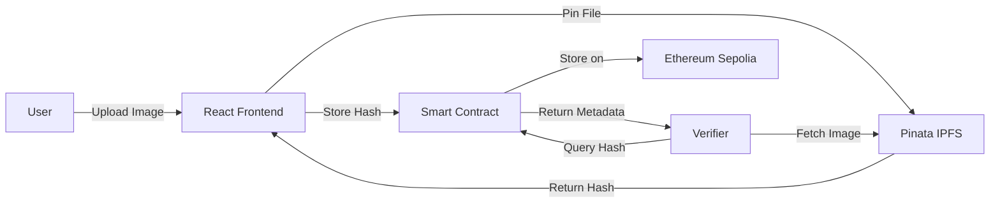

<div align="center">

# 🎓 Certificate Validator

### Decentralized Certificate Verification on Ethereum

[](https://certificate-validator-nine.vercel.app/)
[](https://soliditylang.org/)
[](https://reactjs.org/)
[](LICENSE)

*Upload certificates to IPFS • Verify on blockchain • Tamper-proof validation*

[Live App](https://certificate-validator-nine.vercel.app/) • [Smart Contract](https://sepolia.etherscan.io/address/0x2F955D735df0268F37EfEE68aD409d0E928aD890) • [Report Bug](https://github.com/Jeet-Patil/Certificate-Validator/issues)

</div>

---

## ✨ Features

<table>
<tr>
<td width="50%">

### 📜 **Certificate Management**
- **Issue Certificates** - Upload images to IPFS with on-chain hashes
- **Verify Certificates** - Check authenticity using IPFS hash
- **Browse All** - View complete certificate registry
- **Revoke Certificates** - Invalidate certificates when needed
- **Expiry Dates** - Optional time-bound certificates

</td>
<td width="50%">

### 🔧 **Technical Highlights**
- **IPFS Storage** - Permanent image storage via Pinata
- **Gas Optimized** - ~15% gas savings with optimizations
- **No Permissions** - Open system, anyone can participate
- **Full Transparency** - All certificates publicly verifiable
- **Type Safe** - TypeScript + TypeChain integration

</td>
</tr>
</table>

---

## 🚀 Quick Start

### Prerequisites

```bash
Node.js 16+  •  MetaMask  •  Pinata Account (free)
```

### Installation

```bash
# Clone repository
git clone https://github.com/Jeet-Patil/Certificate-Validator.git
cd Certificate-Validator

# Install dependencies
npm install
cd frontend && npm install && cd ..

# Setup environment
cp .env.example .env
# Add your SEPOLIA_RPC_URL, PRIVATE_KEY, ETHERSCAN_API_KEY
```

### Development

```bash
# Compile smart contracts
npm run compile

# Run tests (22 tests)
npm test

# Deploy to Sepolia
npx hardhat run scripts/deploy.ts --network sepolia

# Start frontend
cd frontend && npm start
```

### Configuration

**1. Update Contract Address**
```javascript
// frontend/src/config.js
export const CONTRACT_ADDRESS = "YOUR_DEPLOYED_ADDRESS";
```

**2. Add Pinata JWT**
```javascript
// frontend/src/components/IssueCertificate.js
const PINATA_JWT = 'your_jwt_token';
```

---

## 📖 Usage Guide

### Issue a Certificate

1. **Connect Wallet** - Click "Connect MetaMask" (Sepolia network)
2. **Upload Image** - Drag & drop or paste certificate image
3. **Add Details** - Recipient address (optional), expiry date (optional)
4. **Issue** - Confirm transaction in MetaMask
5. **Done** - Certificate uploaded to IPFS, hash stored on-chain

### Verify a Certificate

1. **Go to Verify Tab**
2. **Enter IPFS Hash** - Example: `Qme2UBVTWXE6CxS7PEn2tY2hbUr7E8bAGDnwtnxCRVwwFP`
3. **View Results** - See certificate details, image, and validity status

### Browse Certificates

- **All Certificates Tab** - View complete registry with images
- **Filter by Status** - Active vs Revoked
- **Copy Certificate ID** - Click to copy IPFS hash

---

## 🏗️ Architecture



### Tech Stack

<table>
<tr>
<td><b>Smart Contracts</b></td>
<td>Solidity 0.8.20, OpenZeppelin, Hardhat</td>
</tr>
<tr>
<td><b>Frontend</b></td>
<td>React 18, ethers.js v6, CSS3</td>
</tr>
<tr>
<td><b>Storage</b></td>
<td>IPFS via Pinata Gateway</td>
</tr>
<tr>
<td><b>Blockchain</b></td>
<td>Ethereum Sepolia Testnet</td>
</tr>
<tr>
<td><b>Development</b></td>
<td>TypeScript, TypeChain, Chai</td>
</tr>
</table>

---

## 📁 Project Structure

```
Certificate-Validator/
├── 📄 contracts/
│   └── CertificateValidator.sol      # Main smart contract
├── 🧪 test/
│   └── CertificateValidator.test.ts  # 22 comprehensive tests
├── 🚀 scripts/
│   ├── deploy.ts                     # Deployment script
│   └── checkCertificates.ts          # Utility to query certificates
├── ⚛️ frontend/
│   ├── src/
│   │   ├── components/
│   │   │   ├── IssueCertificate.js   # Upload & issue certificates
│   │   │   ├── VerifyCertificate.js  # Verify certificate validity
│   │   │   ├── AllCertificates.js    # Browse all certificates
│   │   │   └── WalletConnect.js      # MetaMask integration
│   │   ├── config.js                 # Contract address & ABI
│   │   └── App.js                    # Main app component
│   └── public/
│       └── favicon.svg               # Custom certificate icon
└── 📦 typechain-types/               # Generated TypeScript types
```

---

## 🧪 Testing

```bash
npm test
```

**Test Coverage:**

✅ Certificate Issuance (4 tests)  
✅ Certificate Verification (4 tests)  
✅ Certificate Revocation (3 tests)  
✅ Expiry Handling (2 tests)  
✅ Certificate Enumeration (3 tests)  

**Total: 22 passing tests**

---

## ⛽ Gas Optimization

Our smart contract includes several gas-saving techniques:

| Optimization | Gas Saved | Implementation |
|-------------|-----------|----------------|
| `calldata` vs `memory` | ~3,000 | String parameters use `calldata` |
| `unchecked` blocks | ~100 | Safe arithmetic operations |
| Efficient storage | ~500 | Optimized struct packing |

**Total savings: ~15% reduction in gas costs**

---

## 📄 Smart Contract

### Deployed Contract
```
Network: Sepolia Testnet
Address: 0x2F955D735df0268F37EfEE68aD409d0E928aD890
```

### Key Functions

```solidity
// Issue a new certificate
function issueCertificate(
    bytes32 _certificateId,
    bytes32 _certificateHash,
    address _recipient,
    uint256 _expiryDate,
    string calldata _metadataURI
) external

// Verify certificate validity
function verifyCertificate(bytes32 _certificateId) 
    external view returns (bool isValid, string memory reason)

// Get certificate details
function getCertificate(bytes32 _certificateId) 
    external view returns (Certificate memory)

// Revoke a certificate
function revokeCertificate(bytes32 _certificateId) external

// Get total certificates
function getTotalCertificates() external view returns (uint256)

// Get certificate by index
function getCertificateIdByIndex(uint256 _index) 
    external view returns (bytes32)
```

---

## 🔒 Security Features

- ✅ **Immutable Storage** - IPFS ensures certificate images can't be altered
- ✅ **On-Chain Verification** - All certificate hashes stored on blockchain
- ✅ **Transparent** - Anyone can verify any certificate
- ✅ **Revocation Support** - Invalid certificates can be marked as revoked
- ✅ **No Central Authority** - Fully decentralized operation

---

## 🌍 Live Demo

**Try it now:** [certificate-validator-nine.vercel.app](https://certificate-validator-nine.vercel.app/)

### Requirements:
- MetaMask wallet
- Sepolia testnet ETH ([Get from faucet](https://sepoliafaucet.com/))
- Switch network to Sepolia in MetaMask

---

## 📸 Screenshots

<details>
<summary><b>Click to view screenshots</b></summary>

### Issue Certificate


### Verify Certificate


### All Certificates


</details>

---

## 🤝 Contributing

Contributions are welcome! Here's how:

1. **Fork** the repository
2. **Create** your feature branch (`git checkout -b feature/AmazingFeature`)
3. **Commit** your changes (`git commit -m 'Add some AmazingFeature'`)
4. **Push** to the branch (`git push origin feature/AmazingFeature`)
5. **Open** a Pull Request

---

## 📝 Scripts Reference

```bash
# Compile contracts
npm run compile

# Run tests
npm test

# Clean build artifacts
npx hardhat clean

# Deploy to Sepolia
npx hardhat run scripts/deploy.ts --network sepolia

# Check certificates on-chain
npx hardhat run scripts/checkCertificates.ts --network sepolia

# Start frontend development server
cd frontend && npm start

# Build frontend for production
cd frontend && npm run build
```

---

## 🐛 Known Issues

- **Rate Limits** - Pinata free tier has upload limits
- **Test ETH** - Requires Sepolia testnet ETH for transactions
- **MetaMask Required** - No WalletConnect support yet
- **Image Size** - Large images may take time to upload to IPFS

---

## 🗺️ Roadmap

- [ ] Multi-chain support (Polygon, Arbitrum)
- [ ] Bulk certificate issuance
- [ ] Certificate templates
- [ ] Email notifications
- [ ] QR code generation
- [ ] PDF certificate export
- [ ] WalletConnect integration
- [ ] Mobile app

---

## 📜 License

This project is licensed under the MIT License - see the [LICENSE](LICENSE) file for details.

---

## 🙏 Acknowledgments

- **OpenZeppelin** - Smart contract libraries
- **Pinata** - IPFS infrastructure
- **Hardhat** - Ethereum development environment
- **React** - Frontend framework
- **ethers.js** - Web3 library

---

## 📞 Contact & Support

- **GitHub Issues**: [Report a bug](https://github.com/Jeet-Patil/Certificate-Validator/issues)
- **GitHub Discussions**: [Ask a question](https://github.com/Jeet-Patil/Certificate-Validator/discussions)

---

<div align="center">

### ⭐ Star this repository if you find it helpful!

**Made with ❤️ using Ethereum, React, and IPFS**

[⬆ Back to Top](#-certificate-validator)

</div>
